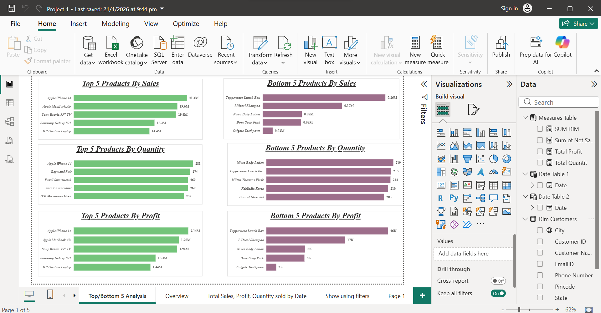
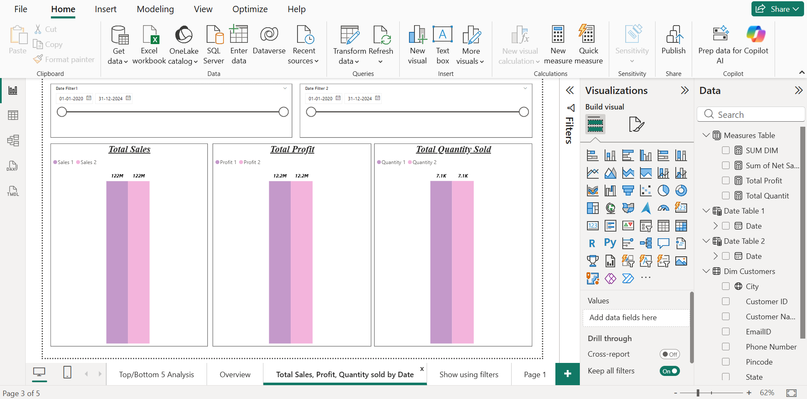
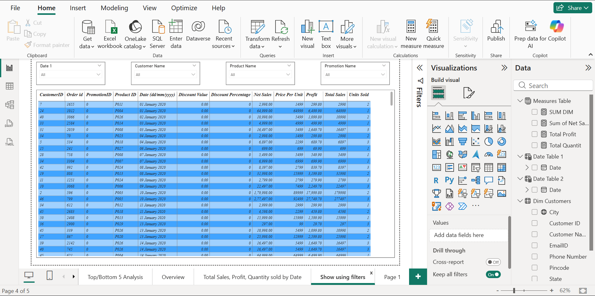

# Sales & Profit Performance Dashboard (Power BI)

## Objective
To analyze sales, profit, quantity sold, and promotional effectiveness across products and time, and present insights through an interactive Power BI dashboard.

## Key Features
- Top & Bottom 5 products by Sales, Quantity, and Profit
- Time-series analysis of sales, profit, and quantity sold
- Profit vs Net Sales relationship analysis
- Promotion-wise discount analysis
- Dynamic filtering by date, customer, product, and promotion

## Tools Used
- Power BI
- DAX (Measures)
- Excel (Data Source)

## Key Insights
- A small set of products drives the majority of revenue and profit
- High discount campaigns do not always translate into higher profit
- Sales spikes are seasonal and time-bound rather than consistent growth-driven
- Profit is strongly correlated with net sales but affected by discount strategies

## Dashboard Preview

### Overview

### Top & Bottom Products

### Sales, Profit & Quantity

### Interactive Filters

